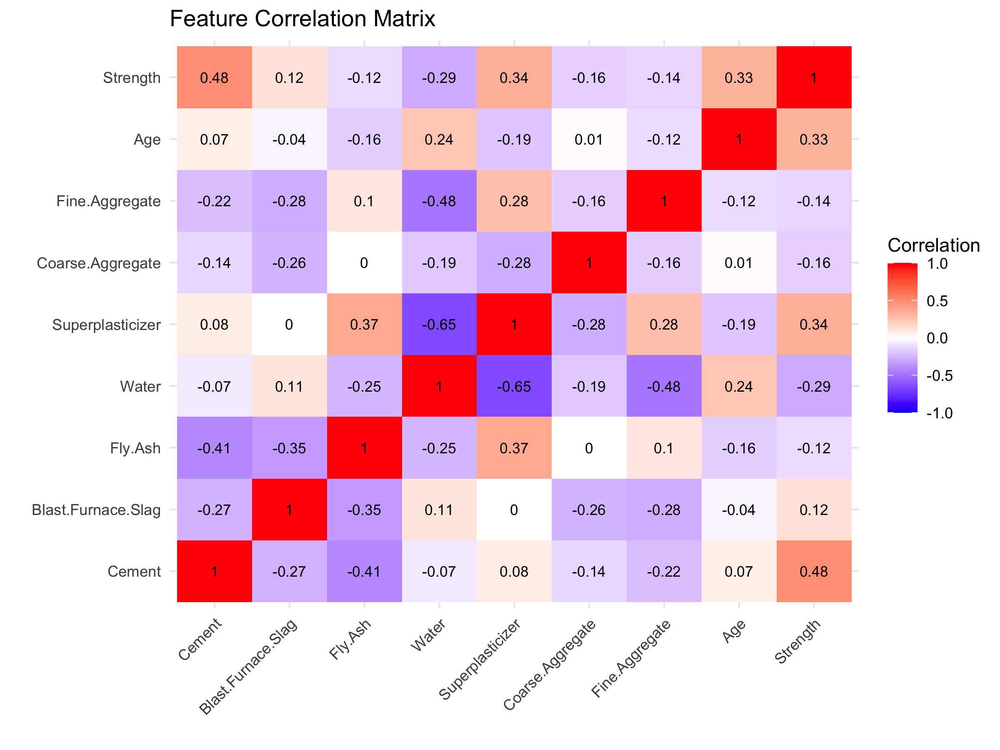
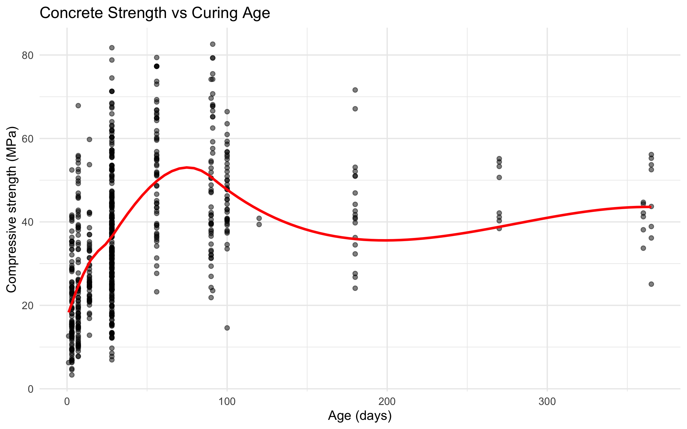
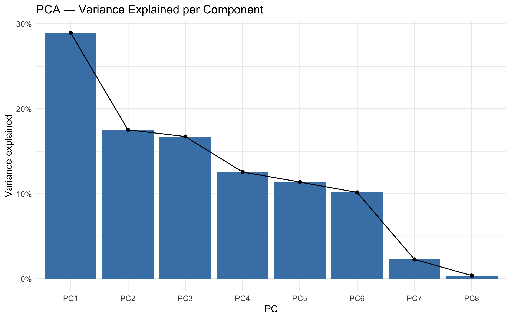
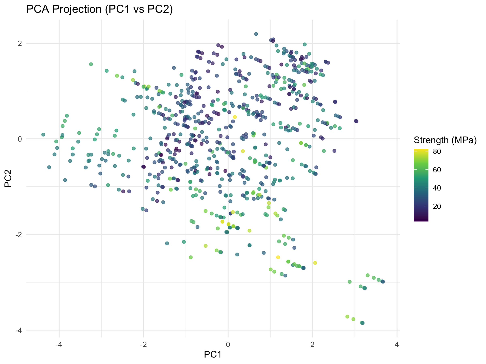

<div align="center">

# 🏗️ Concrete Compressive Strength Analysis

**Exploratory data analysis and machine-learning preprocessing pipeline in R**


</div>

---

## Overview

Concrete compressive strength is the most important property in structural engineering, yet measuring it requires destructive lab testing after days or weeks of curing. Predicting strength from the mix composition can save time, cost and material.

This project builds a **reproducible R pipeline** that takes raw, incomplete concrete mix data and prepares it for predictive modelling. It covers data profiling, **multiple imputation of missing values**, **outlier detection**, **correlation analysis**, **feature scaling** and **Principal Component Analysis (PCA)**.

---

## Dataset

The data describes 1,030 concrete mixtures (722 training and 308 test samples). Each sample has 8 input features and 1 target.

| Feature | Unit | Description |
|---|---|---|
| Cement | kg/m³ | Primary binder |
| Blast Furnace Slag | kg/m³ | Supplementary cementitious material |
| Fly Ash | kg/m³ | Supplementary cementitious material |
| Water | kg/m³ | Mixing water |
| Superplasticizer | kg/m³ | Workability admixture |
| Coarse Aggregate | kg/m³ | Gravel or crushed stone |
| Fine Aggregate | kg/m³ | Sand |
| Age | days | Curing time (1–365) |
| **Strength** | **MPa** | **Target: compressive strength** |

Source: *Concrete Compressive Strength* dataset (I-Cheng Yeh), UCI Machine Learning Repository. The version used here contains injected missing values to simulate real-world data quality issues.

---

## Pipeline

```
 Raw CSV ─▶ Profiling ─▶ MICE Imputation ─▶ Outlier Detection ─▶ Correlation
                                                                    │
      PCA  ◀── Min-Max Scaling (fit on train, apply to test) ◀──────┘
```

| Step | Technique | Purpose |
|---|---|---|
| **1. Profiling** | `str`, `summary`, `md.pattern` | Understand types, distributions and missing-data patterns |
| **2. Imputation** | MICE with Predictive Mean Matching (m = 5, 50 iterations) | Fill missing values while preserving realistic distributions |
| **3. Outliers** | IQR rule (1.5 × IQR) with box plots | Identify extreme mixes per feature |
| **4. Correlation** | Pearson correlation heatmap | Detect multicollinearity between ingredients |
| **5. Scaling** | Min-max normalisation fitted on the training set | Put features on a common 0–1 scale without data leakage |
| **6. PCA** | `prcomp` with scree plot and projection | Measure redundancy and reduce dimensionality |

---

## Key Findings

- **Age drives strength.** Compressive strength rises steeply over the first 28 days, then plateaus: the classic curing curve.
- **Cement content and superplasticizer** correlate positively with strength, while **water** correlates negatively. This matches the water–cement ratio principle in concrete engineering.
- **Superplasticizer and water** are strongly negatively correlated, a multicollinearity signal worth handling before modelling.
- Every feature contained **roughly 2–7% missing values**. MICE imputation kept each feature's distribution intact rather than collapsing it to a mean.
- **Outliers** appear mainly in Age, Slag, Superplasticizer and Water. They reflect genuine specialised mixes rather than errors, so they were retained.

---

## Visualisations

Running the script generates these figures in `figures/`:

| Correlation Heatmap | Strength vs Age |
|---|---|
|  |  |

| PCA Variance Explained | PCA Projection |
|---|---|
|  |  |

---

## Getting Started

### Prerequisites
- [R](https://cran.r-project.org/) 4.0+
- [RStudio](https://posit.co/download/rstudio-desktop/) (recommended)

### Run

```bash
git clone https://github.com/Sabin78910/concrete-strength-analysis.git
cd concrete-strength-analysis
Rscript concrete_strength_analysis.R
```

Or open `concrete_strength_analysis.R` in RStudio and click **Source**. Missing packages (`mice`, `ggplot2`, `reshape2`) install automatically.

---

## Project Structure

```
concrete-strength-analysis/
├── data/
│   ├── concrete_strength_train.csv
│   └── concrete_strength_test.csv
├── figures/                         # Generated plots
├── concrete_strength_analysis.R     # Full analysis pipeline
└── README.md
```

---

## Next Steps

- [ ] Train regression models (Linear Regression, Random Forest, XGBoost, Neural Network)
- [ ] Compare models with RMSE, MAE and R² using cross-validation
- [ ] Feature importance and SHAP explanations
- [ ] Interactive Shiny app for strength prediction from a mix design

---

## Author

**Sabin Khanal**
Software Developer · Data & Machine Learning

[](https://www.linkedin.com/in/sabin-khanal-950163326/)
[](https://github.com/Sabin78910)
